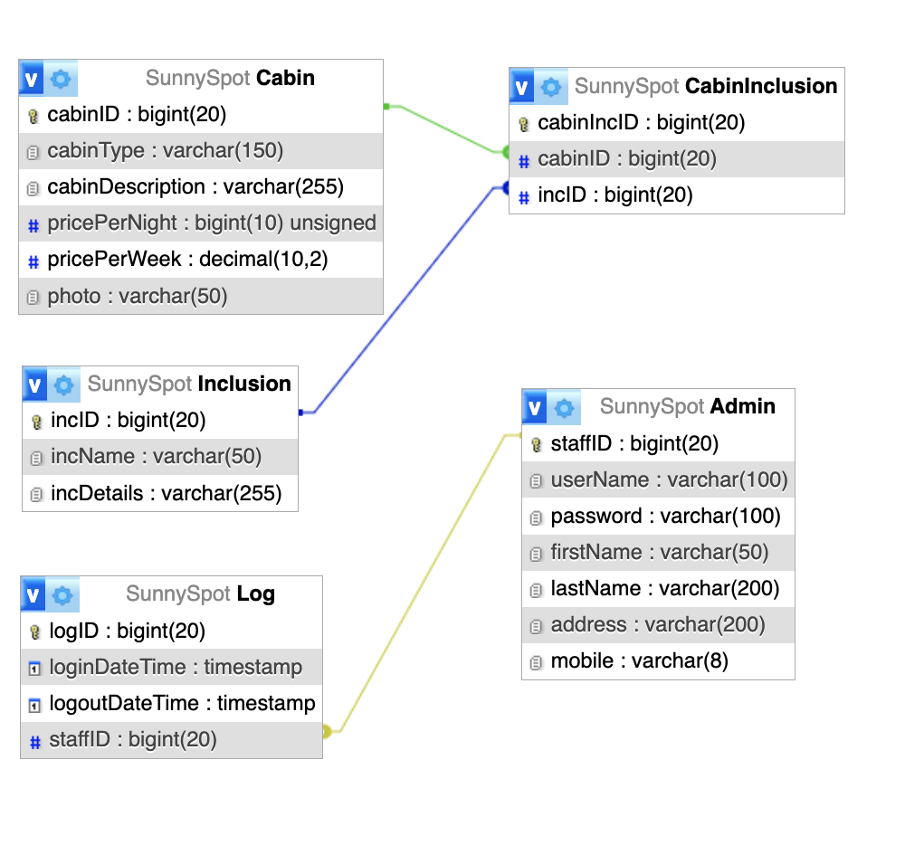
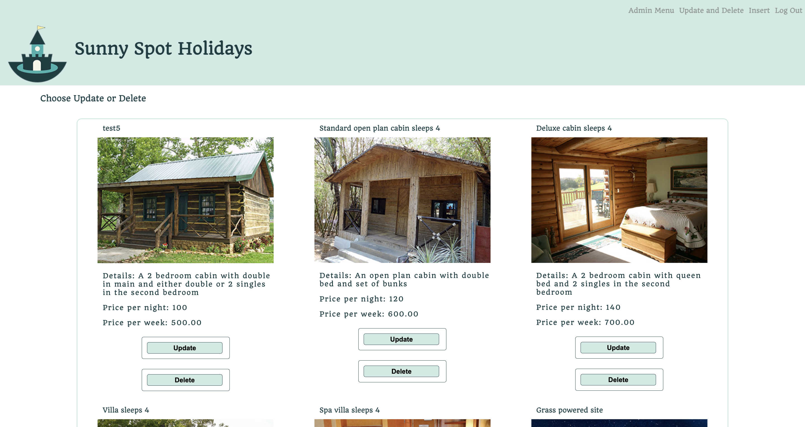
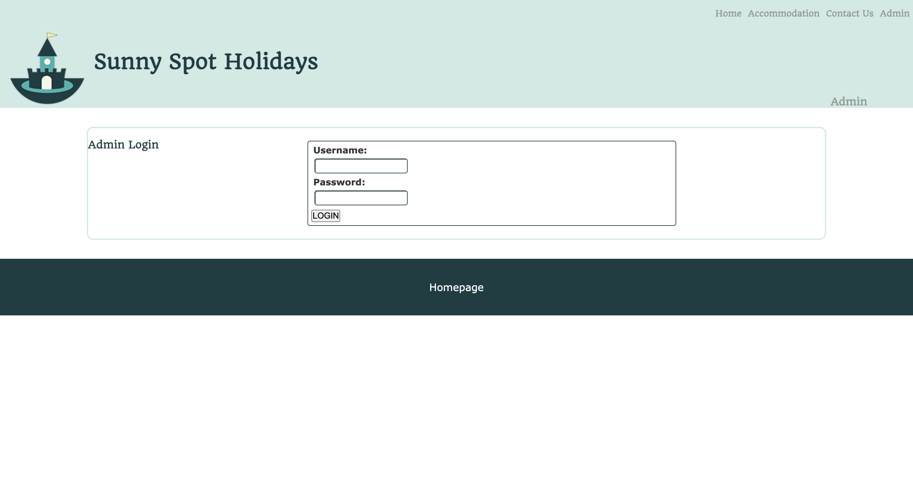
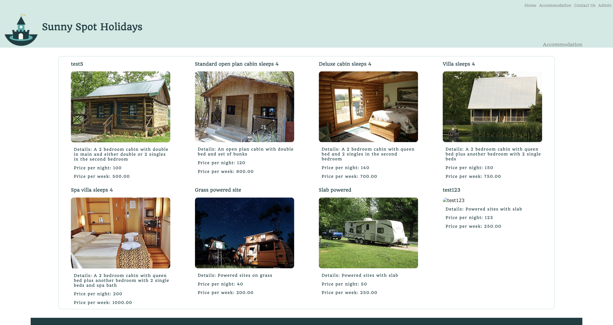

# Holiday Camp Booking Website


A website for a holiday accommodation business showcasing available cabins and their details. This project demonstrates my skills with database management and web development using PHP and MySQL.

## Project Features & Screenshots

### Database Design

*Entity Relationship Diagram showing the database structure with tables for cabins, inclusions, admin users, and their relationships*

### Cabin Management System

*Admin interface for performing CRUD operations on cabin data, including price validation and image handling*

### Secure Admin Access

*Secure login system with database authentication and session management*

### Public Cabin Listings

*Database-driven display of available cabins with dynamic pricing and descriptions*

## Technologies Used

- PHP with mysqli for database operations
- MySQL database
- HTML/CSS for frontend
- XAMPP as the development environment

## Database Features Demonstrated

1. **Database Operations**
   - SELECT queries to display cabin information
   - INSERT operations for adding new cabins
   - UPDATE operations for modifying cabin details
   - DELETE operations for removing cabins

2. **Admin Panel**
   - Secure login system
   - Database management interface
   - CRUD operations for cabin management

3. **Data Handling**
   - Form data validation
   - Prepared statements for security
   - Image upload handling

## Project Structure

```
SunnySpotHoliday/
├── admin/
│   ├── Database.php      # Database connection and operations
│   ├── login.php         # Admin login
│   ├── insertProcess.php # Handle cabin insertions
│   └── delete.php        # Handle cabin deletions
├── database/             # SQL files for database setup
│   ├── create_and_populate.sql  # Creates tables and inserts initial data
│   └── database_structure.sql   # Complete database structure with constraints
├── images/               # Cabin images
├── allCabins.php        # Display all cabins
├── contact.html         # Contact page
├── index.html           # Home page
└── style.css           # Styling
```

## Database Schema

The database consists of several interconnected tables to manage cabins, inclusions, and admin users:

### Main Tables

1. **Cabin Table**
```sql
CREATE TABLE Cabin (
    cabinID BIGINT AUTO_INCREMENT PRIMARY KEY,
    cabinType VARCHAR(150),
    cabinDescription VARCHAR(255),
    pricePerNight BIGINT(10) UNSIGNED,
    pricePerWeek DECIMAL(10,2),
    photo VARCHAR(50)
);
```

2. **Admin Table**
```sql
CREATE TABLE Admin (
    staffID BIGINT AUTO_INCREMENT PRIMARY KEY,
    userName VARCHAR(100),
    password VARCHAR(100),
    firstName VARCHAR(50),
    lastName VARCHAR(200),
    address VARCHAR(200),
    mobile VARCHAR(8)
);
```

3. **Additional Features**
   - Inclusion table for cabin amenities
   - CabinInclusion table for many-to-many relationships
   - Log table for tracking admin activities

## Database Setup

The project includes two SQL files in the `database` directory:

1. **create_and_populate.sql**
   - Creates the database and all tables
   - Sets up proper data types and constraints
   - Includes price validation rules
   - Populates tables with initial data:
     - Sample cabins with descriptions and prices
     - Admin users
     - Cabin inclusions and amenities

2. **database_structure.sql**
   - Complete database structure export
   - All table definitions with proper character sets
   - Foreign key relationships
   - Auto-increment settings
   - Index definitions

## Key Features

1. **Cabin Management**
   - Display available cabins
   - Add new cabins with images
   - Update cabin information
   - Remove cabins from database

2. **Price Management**
   - Set nightly and weekly rates
   - Automatic price validation
   - Price format handling

3. **Image Handling**
   - Upload cabin images
   - Store image paths in database
   - Display images with cabin details

---

## Acknowledgment

This README documentation was created with the assistance of an AI tool (Claude). The project implementation, including all code, database design, and functionality, was developed independently by me. Only the README's structure and formatting were enhanced using AI assistance. 
